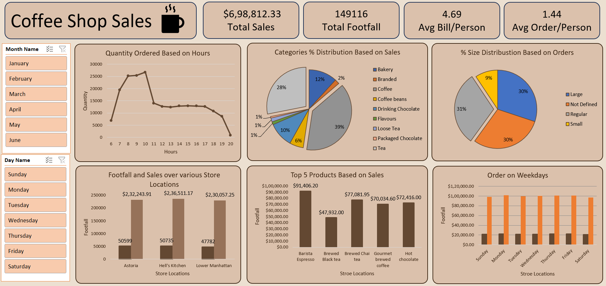

# ☕ Coffee Shop Sales Analysis (Advanced Excel Project)

This project analyzes coffee shop sales data using **Advanced Excel**. The goal is to extract meaningful insights from sales, footfall, and product trends using Excel-based techniques like Pivot Tables, Charts, Slicers, and KPIs. An interactive dashboard has been created to visualize and communicate the findings effectively.

---

## 📸 Dashboard Preview



---

## 📁 Project Files

```
coffee-shop-sales-analysis-excel/
├── 01_Coffee_Shop_Sales_Dataset.xlsx         ← Dataset (Excel)
├── 02_Coffee_Shop_Sales_Analysis.pdf         ← Business Questions & Insights
├── 03_Coffee_Shop_Sales_Dashboard.png        ← Final Dashboard (screenshot)
├── README.md                                 ← This documentation
```

---

## 📊 Dashboard KPIs

- 💰 Total Sales: $698,812.33  
- 👣 Total Footfall: 149,116  
- 🧾 Avg Bill per Person: $4.69  
- 🛍️ Avg Orders per Person: 1.44  

---

## 🔍 Business Questions Answered

- Which are the **top-performing products**?
- What are the **peak order hours** and **sales by weekday**?
- How does revenue differ by **store location**?
- What’s the **sales split by product size and category**?
- What are the monthly sales & trends?

---

## 🧠 Key Insights

- **Morning hours (8 AM – 10 AM)** are the busiest
- **Tea** is the highest contributing category (39%)
- **Hell's Kitchen** store generates the most sales
- **Regular** and **Large** are the most popular sizes
- **Barista Espresso** is the top-selling product

---

## 🛠 Tools & Techniques

- Advanced Excel
  - Pivot Tables & Pivot Charts
  - Data Cleaning
  - Slicers & Filters
  - KPI Cards & Number Formatting
  - Dashboard Design (Visual + Functional)

---

## 🙋‍♂️ About Me

**Prasenjit Barman**  
Aspiring Data Analyst | Excel • Power BI • SQL • Python  
📫 Email: prasenjitbarman.5687@gmail.com  
🔗 [GitHub](https://github.com/prasenjit1234674)  
🔗 [LinkedIn](https://www.linkedin.com/in/prasenjit-barman-968283359/)

> ⭐ If you found this project helpful, feel free to give it a star and check out my other work!
